# [👋]{.wave} Bun venit

```{=html}
<style>
  .wave {
  animation-name: wave-animation;  /* Refers to the name of your @keyframes element below */
  animation-duration: 2.5s;        /* Change to speed up or slow down */
  animation-iteration-count: infinite;  /* Never stop waving :) */
  transform-origin: 70% 70%;       /* Pivot around the bottom-left palm */
  display: inline-block;
}

@keyframes wave-animation {
    0% { transform: rotate( 0.0deg) }
   10% { transform: rotate(14.0deg) }  /* The following five values can be played with to make the waving more or less extreme */
   20% { transform: rotate(-8.0deg) }
   30% { transform: rotate(14.0deg) }
   40% { transform: rotate(-4.0deg) }
   50% { transform: rotate(10.0deg) }
   60% { transform: rotate( 0.0deg) }  /* Reset for the last half to pause */
  100% { transform: rotate( 0.0deg) }
}
</style>
```


## Cine sunt eu?

<br>

Mă numesc **Nicu Calcea**.

Sunt **jurnalist de investigație în domeniul datelor**.

Am absolvit și predat la **City, University of London**, și am făcut jurnalism de date la ***Global Witness***, ***BBC News*** și ***New Statesman***. În Moldova am fost co-fondator al [Privesc.Eu](https://privesc.eu/) și reporter la [Moldova.org](https://www.moldova.org/).


## Publicațiile mele

- [Exclusive: Tory MPs would be over £1m worse off in six months with Boris Johnson’s second job ban](https://www.newstatesman.com/politics/uk-politics/2021/11/exclusive-tory-mps-would-be-over-1m-worse-off-in-six-months-with-boris-johnsons-second-job-ban)
- [Eight out of ten firms pay men more than women](https://www.bbc.co.uk/news/business-65179430)
- [UK PR firms increased fossil fuels lobbying since Paris Agreement](https://globalwitness.org/en/campaigns/fossil-fuels/uk-pr-firms-increased-fossil-fuels-lobbying-since-paris-agreement/)


## Mai multe informații despre mine

- [Site personal](https://nicu.md/)
- [SAMIZDATA](https://samizdata.co/ro)
- [mail@nicu.md](mailto:mail@nicu.md)


## Introduceri

- Cum vă numiți?
- De ce ați ales să participați la acest training?
- Ce experiență aveți în jurnalismul de date?


## Program {.smaller}

- 10:00 — Introduceri și obiective
- 10:15 — Ce este jurnalismul de date?
- 11:30 — Baze de date
- 11:45 — Exercițiu: Disparitatea salarială de gen
- *12:30 — Pauză*
- 13:30 — Instrumente AI
- 14:15 — Vizualizarea datelor
- 15:00 — Exercițiu: Prenumele nou-născuților
- 15:30 — Exercițiu de grup
- 16:30 — Întrebări și răspunsuri, resurse suplimentare, discuții

::: {.incremental}
:::


# Ce este jurnalismul de date?

> În definiția sa cea mai simplă, jurnalismul de date este practica de a folosi numere și tendințe pentru a spune o poveste. --- **Betsy Ladyzhets**

::: notes
În engleză, jurnalismul de date este numit data journalism, data-driven journalism, computer-assisted reporting sau CAR (în SUA), precision journalism. Istoria sa este chiar mai veche: prima ediție a ziarului The Guardian (Manchester Guardian) a avut un articol de jurnalism de date. Așadar, nu vă concentrați prea mult pe cum îl numiți.
:::

. . .

> Jurnalismul de date este găsirea -- în date -- a materialelor jurnalistice care sunt de interes pentru public și prezentarea lor în cel mai potrivit mod pentru utilizarea și reutilizarea de către public. --- **Bahareh Heravi**

::: notes
Jurnalismul de date nu înseamnă că trebuie să vă limitați la date: facem tot ce fac și alți reporteri, inclusiv interviuri, solicitări de informații, investigații pe teren, scrierea articolelor, redactare, multimedia (când este relevant), fact-checking, etc.
:::


## De ce avem nevoie de jurnalismul de date? {.title-slide}

## {#why-we-need-ddj data-menu-title="Why we need data journalism" .smaller}

::: columns
::: {.column width="33.33%"}
##### Materiale jurnalistice mai profunde
Tot mai mult din activitatea umană este înregistrată și stocată ca date. Asta înseamnă că există potențial pentru jurnalism de date pentru aproape orice subiect.
:::

::: {.column width="33.33%"}
##### Eficiență
Deseori, munca noastră e repetitivă. Putem simplifica și automatiza monitorizarea, colectarea și analiza informațiilor publice, oferindu-ne mai mult timp pentru a ne concentra pe subiecte mai profunde.
:::

::: {.column width="33.33%"}
##### Precizie
Datele ne ajută să verificăm afirmațiile făcute de politicieni, funcționari, oameni de afaceri, și alții.
:::

::: {.column width="33.33%"}
##### Materiale jurnalistice noi
Jurnaliștii pot crea materiale noi pe baza datelor pe care nu ar putea să le acopere altfel.
:::

::: {.column width="33.33%"}
##### Știri personalizate
Putem crea materiale personalizare pentru cititori pe baza localității în care locuiesc, vârstei sau statutului socio-economic.
:::

::: {.column width="33.33%"}
##### Audiențe noi
Jurnalismul de date poate atrage noi audiențe, inclusiv tineri și persoane care nu citesc ziarele tradiționale.
:::
:::


## {fullscreen=true}
[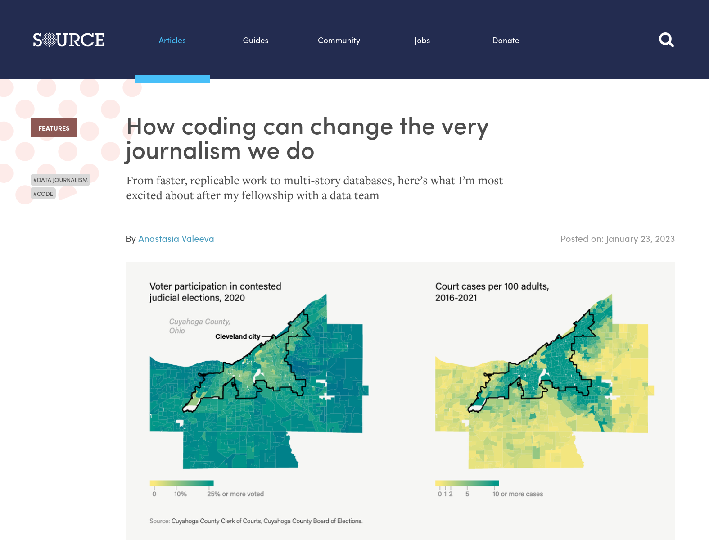](https://source.opennews.org/articles/how-coding-can-change-very-journalism-we-do/)

::: footer
Sursă: [OpenNews](https://source.opennews.org/articles/how-coding-can-change-very-journalism-we-do/)
:::


## Procesul

::: columns
::: {.column width="33.33%"}
:::  {.fragment}
##### Întrebare
Ca și în cazul jurnalismului tradițional, jurnalismul de date începe cu o întrebare pe care reporterul vrea să o răspundă.
:::
:::

::: {.column width="33.33%"}
:::  {.fragment}
##### Identificarea surselor
Datele pot veni din surse oficiale, de la societatea civilă, alte terțe părți, sau pot fi colectate direct de către reporter.
:::
:::

::: {.column width="33.33%"}
:::  {.fragment}
##### Curățarea și structurarea datelor
În majoritatea cazurilor, reporterul trebuie să filtreze, sorteze și să corecteze erori sau informații lipsă din setul de date.
:::
:::
:::

## Procesul

::: columns
::: {.column width="33.33%"}
##### Analiza datelor
Cum găsești răspunsul la întrebarea ta în date?
:::

::: {.column width="33.33%"}
:::  {.fragment}
##### Verificarea datelor
Datele nu mint, însă cei care le publică o fac. Au concluziile analizei tale sens? Le poți verifica din alte surse?
:::
:::

::: {.column width="33.33%"}
:::  {.fragment}
##### Prezentare
Analiza poate fi comunicată publicului în mai multe moduri. Uneori, dar nu întotdeauna, jurnaliștii de date vor vizualiza rezultatele analizei.
:::
:::
:::

::: notes
Analyse data: be platform agnostic. Some tools die because APIs change, others are abandoned by their developers, some are replaced by better alternatives.
:::

##

[](https://onlinejournalismblog.com/2011/07/07/the-inverted-pyramid-of-data-journalism/)

::: footer
Sursă: [Paul Bradshaw](https://onlinejournalismblog.com/2011/07/07/the-inverted-pyramid-of-data-journalism/)
:::

## 

[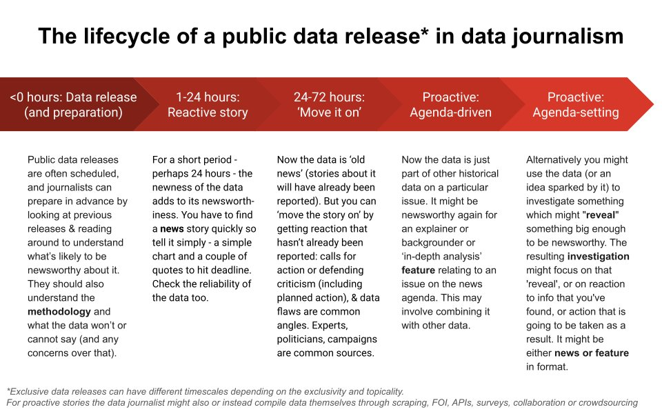](https://twitter.com/paulbradshaw/status/1445015559742050312)

::: footer
Sursă: [Paul Bradshaw](https://twitter.com/paulbradshaw/status/1445015559742050312)
:::


## Ce sunt datele deschise?

Definiția oficială:

- **Date oficiale**: Direct din registrele și sistemele instituțiilor publice.
- **Acces gratuit**: Fără înregistrare, accesibil oricui, oricând.
- **Format deschis**: XLS/XLSX, ~~PDF~~, ~~DOCX~~, CSV, ZIP — prelucrabile automat.

::: footer
Sursă: [Agenția de Guvernare Electronică](https://date.gov.md/#:~:text=Date%20deschise%20prin%20defini%C8%9Bie)
:::

## Ce sunt datele deschise?

Eu aș adăuga:

- **Date structurate**: Date publicate în formate accesibile atât pentru oameni, cât și pentru software (CSV, JSON, XML, RDF, nu PDF sau DOCX).
- **Licență deschisă**: Datele pot fi utilizare fără restricții.

## Ce întrebări pot răspunde datele deschise?

- Unde sunt cele mai mari disparități regionale?
- Există diferențe între zonele urbane și rurale?
- Ce categorii de populație beneficiază cel mai puțin de un serviciu public?
- Unde trebuie prioritizate investițiile?
- Ce programe publice produc rezultate?
- Cum s-au schimbat indicatorii după introducerea unei politici?
- Cum poate fi îmbunătățită alocarea resurselor publice?


# Situația din Moldova

## Clasament

[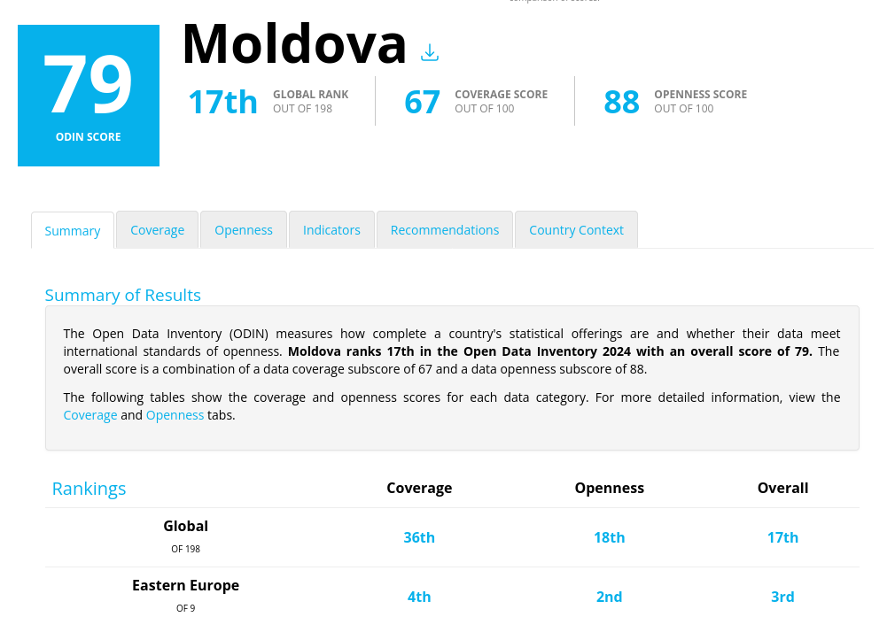](https://odin.opendatawatch.com/country-profiles/MDA?year=2024)

::: footer
Sursă: [Open Data Inventory](https://odin.opendatawatch.com/country-profiles/MDA?year=2024)
:::

<!-- ## Ce zice OGP?

> Planul de acțiune Open Government Partnership OGP al Republicii Moldova pentru 2023–2025 a înregistrat niveluri ridicate de implementare și o colaborare puternică între guvern și societatea civilă. -->


## Legea 109/2025

- transpune parțial Directiva (UE) 2019/1024 și înlocuiește Legea nr. 305/2012;
- acoperă organismele publice, întreprinderile publice și datele din cercetarea finanțată public;
- introduce seturi de date cu valoare ridicată, reutilizare gratuită (cu excepții) și o licență standard pentru date deschise;
- exclude datele personale și informațiile protejate prin lege.

::: footer
Sursă: [Registrul de stat al actelor juridice](https://www.legis.md/cautare/getResults?doc_id=148946&lang=ro)
:::


## Baze de date {fullscreen=true}

<iframe class="stretch" data-src="https://samizdata.co/training/sources/moldova/"></iframe>
::: footer
Sursă: [SAMIZDATA](https://samizdata.co/training/sources/moldova/)
:::


## Probleme

- Datele sunt deseori publicate în formate inaccesibile (PDF, DOCX) sau neuniforme
- Multe seturi de date nu sunt actualizate la timp, au câmpuri incomplete
- Acces limitat la date în administrația publică locală
- Echilibru neclar cu protecția datelor personale
- Datele existente nu sunt utilizare suficient (ceea ce încercăm să rezolvăm aici)


# Instrumente

<iframe class="stretch" data-src="https://samizdata.co/training/toolbox/"></iframe>

::: footer
Sursă: [SAMIZDATA](https://samizdata.co/training/toolbox/)
:::


# Exercițiu: Disparitatea salarială de gen

- [Eight out of ten firms pay men more than women](https://www.bbc.com/news/business-65179430)
- [What is the gender pay gap where you work?](https://www.bbc.com/news/business-65207049)
- [How big is the gender pay gap in the mining industry in Britain and who are the worst offenders?](https://www.mining-technology.com/features/exclusive-how-big-is-the-gender-pay-gap-in-the-mining-industry-in-britain-and-who-are-the-worst-offenders/)


## Exercițiu: Disparitatea salarială de gen

1. Deschideți [pagina Statbank](https://statbank.statistica.md/)
2. Accesați secțiunea "[Statistica gender](https://statbank.statistica.md/PxWeb/pxweb/ro/50%20Statistica%20gender/)" -> Abilitarea economica a femeilor -> Disparitatea salariala de gen pe activitati economice, 2013-2025
3. Selectați toate activitățile economice și anii 2013-2025, apoi apăsați "Continuă"
4. Descărcați fișierul Excel și încărcați-l în Google Drive, deschideți-l cu Google Sheets

## Exercițiu: Disparitatea salarială de gen

1. Copiați foaia de calcul, nu faceți modificări în original. 
2. Ștergeți antetul și subsolul.
3. View -> Freeze top row -> View -> Freeze first column.
4. Sortați după coloana 2025.
5. Ștergeți rândurile "B+C+D+E Industrie total", "S Alte activitati de servicii" și "0 Activitati economice - total".

::: notes
Selectați foaia de calcul -> Protect sheet -> Show a warning when editing this sheet.

Opțional: Adăugați un nume pentru prima coloană, ștergeți literele din numele activităților, adăugați diacritice și simplificați numele activităților.
:::

## Exercițiu: Disparitatea salarială de gen

1. Creați un grafic nou în [Datawrapper](https://www.datawrapper.de/).
2. Copiați tabelul creat în Datawrapper, selectați limba română, bar chart.
3. Personalizați graficul, adăugați titluri și surse. Aveți grijă la [diferența dintre puncte și puncte procentuale](https://calculprocente.com/art/procent-%C8%99i-punct-procentual).
4. Publicați și/sau descărcați graficul.

::: notes
Cât este 10% + 50%? Răspunsul corect este 15%, nu 60%.
:::


## GenderPulse

<iframe class="stretch" data-src="https://genderpulse.md/ro"></iframe>

::: footer
Sursă: [GenderPulse](https://genderpulse.md/ro)
:::


## Datele nu sunt neutre

- Datele publicate reflectă prejudecățile și limitele autorilor.
- Majoritatea indicatorilor — atât în Moldova [cât și în afară](https://blogs.worldbank.org/en/opendata/unpacking-mystery-missing-gender-data) — nu sunt dezagregate pe gen.
- Datele agregate pot ascunde diferențe importante. La ce vârste și în ce grupuri sociale sunt disparitățile de gen mai mari?
- Când datele nu există, [creați-le](https://texty.org.ua/projects/114050/spoon-of-hate-online-violence-against-ukrainian-female-journalists-in-youtube-comments/)!

::: notes
Menționează că o mare parte din explicație este [concediul de maternitate](https://www.vox.com/2018/2/19/17018380/gender-wage-gap-childcare-penalty).
:::

## Asigurați-vă că munca voastră e verificabilă {.smaller}

Concepte importante:

::: columns
::: {.column width="50%"}
Documentație

- păstrați neschimbate referințele la datele sursă
- dacă este necesar, adăugați un dicționar de date sau notați ce ați făcut
- folosiți denumiri adecvate pentru coloane (nu „greutate”) și foi de calcul (nu „Foaie1”)
- o întrebare = o foaie de calcul
:::

::: {.column width="50%"}
Reproductibilitate

- efectuați analizele pe o foaie nouă, niciodată pe datele originale
- protejați foaia de calcul originală
- faceți copii de rezervă frecvent
:::
:::

[Mai multe detalii de la OCCRP](https://docs.google.com/presentation/d/1VpLdSJDvVAdtPOaMuwsw3aRY0vEv3NWJZbe2SdYKJrU/edit).

::: notes
https://docs.google.com/presentation/d/1VpLdSJDvVAdtPOaMuwsw3aRY0vEv3NWJZbe2SdYKJrU/edit
:::

## Pregătirea datelor

<iframe class="stretch" data-src="https://academy.datawrapper.de/article/240-how-to-prepare-your-data-for-datawrapper-in-excel-or-google-sheets"></iframe>

::: footer
Sursă: [Datawrapper](https://academy.datawrapper.de/article/240-how-to-prepare-your-data-for-datawrapper-in-excel-or-google-sheets)
:::

## {#dirty-data data-menu-title="Dirty Data" .smaller}


::: columns
::: {.column width="33.33%"}
##### Date lipsă
Uneori, înregistrările dispar sau nu au fost colectate niciodată. Nu este întotdeauna evident când asta se întâmplă.
:::

::: {.column width="33.33%"}
##### Date duplicate
Înregistrările pot fi repetate, fie din cauza unor erori tehnice, fie din cauza introducerii repetate a datelor.
:::

::: {.column width="33.33%"}
##### Greșeli ortografice
Oamenii fac greșeli. Presupuneți că orice set de date creat manual de oameni conține greșeli ortografice.
:::

::: {.column width="33.33%"}
<br>

##### Formatare necorespunzătoare
Unele foi de calcul sunt concepute pentru a fi citite de oameni, nu de calculatoare. Prin urmare, trebuie procesate suplimentar.
:::

::: {.column width="33.33%"}
<br>

##### Erori de analiză
O formulă Excel greșită? Caractere n€©unoș©uț€? O versiune veche de Excel? Toate acestea pot afecta datele tale.
:::

::: {.column width="33.33%"}
<br>

##### Date inconsistente
O coloană poate conține unități de măsură diferite, poate denumi categoriile în mod diferit sau poate înregistra metodologii diferite.
:::
:::

## Ghidul datelor eronate

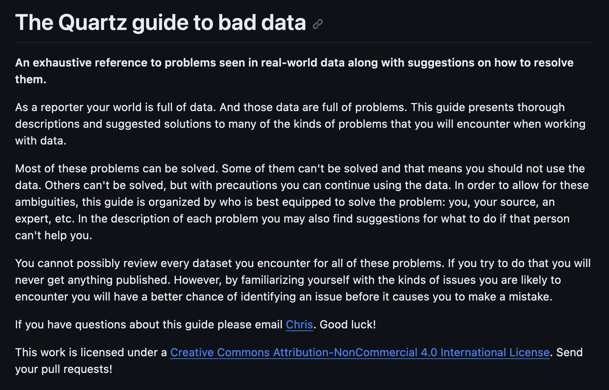

::: footer
Sursă: [Quartz](https://github.com/Quartz/bad-data-guide)
:::


## {#inflation-screenshot data-menu-title="Date inflație ONS" .smaller}

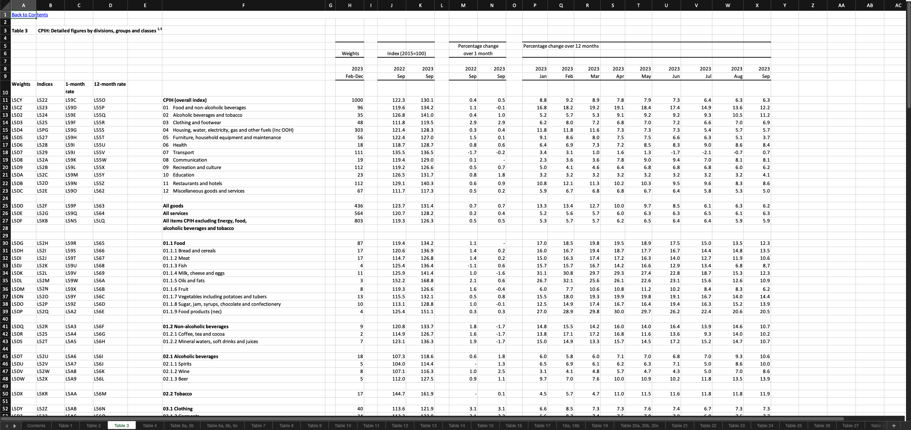

::: footer
Sursă: [ONS](https://www.ons.gov.uk/economy/inflationandpriceindices/datasets/consumerpriceinflation)
:::


##  {#basic-excel-formulas-1-recap data-menu-title="Formule Excel"}

::: columns
::: {.column width="33.33%"}
##### =A1+A2
Calculează suma (+) sau diferența (-) dintre două numere.
:::

::: {.column width="33.33%"}
##### =A1*B1
Multiplică (*) sau divizează două numere.
:::

::: {.column width="33.33%"}
##### =SUM()
Calculează suma unui șir de numere (de exemplu, o coloană).
:::

::: {.column width="33.33%"}
##### =AVERAGE()
Calculează media unui șir de numere.
:::

::: {.column width="33.33%"}
##### [=MEDIAN()]
Calculează [mediana](https://ro.wikipedia.org/wiki/Median%C4%83_(statistic%C4%83)) unui șir de numere.
:::

::: {.column width="33.33%"}
##### =(NOU-VECHI)/VECHI
Calculează (des)creșterea procentuală între două valori.
:::
:::


##  {#basic-excel-formulas-2 data-menu-title="Basic Excel Formulas 2"}

::: columns
::: {.column width="33.33%"}
##### =IF()
Returnează o valoarea dacă rezultatul e adevărat, alta dacă e fals.
:::

::: {.column width="33.33%"}
##### =COUNTIF()
Numără celulele care îndeplinesc o anumită condiție.
:::

::: {.column width="33.33%"}
##### =SUMIF()
Sumează toate celulele care îndeplinesc o anumită condiție.
:::

::: {.column width="33.33%"}
##### =CONCATENATE()
Combină mai multe fragmente de text.
Pentru operația inversă, utilizați funcția =SPLIT().
:::

::: {.column width="33.33%"}
##### =VLOOKUP()
Asociază valorile dintr-o celulă cu rândul corespunzător dintr-un alt set de date.
:::

::: {.column width="33.33%"}
##### =XLOOKUP()
Similar cu funcția =XLOOKUP(), dar mai flexibil și mai ușor de înțeles.
:::
:::


# Pauză


# Instrumente AI

Inteligența Artificială (AI) poate automatiza anumite procese în jurnalism și analiza de date.

AI-ul însă poate [halucina](https://en.wikipedia.org/wiki/Hallucination_(artificial_intelligence)), și trebuie utilizat responsabil.

## Tipuri de instrumente AI

::: columns
::: {.column width="33.33%"}
:::  {.fragment}
##### Skills
Agenții AI pot căpăta abilități (skills) noi pentru sarcini specifice. Acestea pot fi instalate din surse externe sau create de tine.
:::
:::

::: {.column width="33.33%"}
:::  {.fragment}
##### MCP / Plugin-uri
MCP (Model Context Protocol) este un sistem de plugin-uri standardizat pentru agenții AI. Și acestea pot fi instalate din surse externe.
:::
:::

::: {.column width="33.33%"}
:::  {.fragment}
##### Agenți dedicați
Pentru anumite sarcini, există agenți specializați care pot fi folosiți direct, fără a fi nevoie de configurare sau instalarea skill-urilor sau plugin-urilor.
:::
:::
:::

## Skills

"[Agent Skills](https://agentskills.io/home)" este un standard pentru a extinde abilitățile agenților AI. Pentru jurnalism, abilitățile pot include instrumente de lucru cu PDF-uri sau documente Excel, crearea graficelor, sau accesarea anumitor baze de date.

Skill-urile pot fi create ad-hoc de către agenții AI sau manual de către jurnalist.

## Skills: Exemple

- [Journalism agent skills](https://github.com/jamditis/claude-skills-journalism)
- [Spotlight](https://spotlight.buriedsignals.com/docs/#skills)
- Creează propriile skill-uri

::: notes
Show Moldova investigation skills in an Obsidian vault (research Ion Onțu).
:::

## MCP / Plugin-uri

[MCP (Model Context Protocol)](https://modelcontextprotocol.io/) este un standard pentru a crea instrumente pentru agenții AI.

## MCP: Exemple

- [OpenRegistry](https://openregistry.sophymarine.com/)
- [Datawrapper MCP](https://github.com/palewire/datawrapper-mcp)
- [mcptools](https://posit-dev.github.io/mcptools/) / [btw](https://posit-dev.github.io/btw/) pentru R

::: notes
<!-- Show how to use the Datawrapper MCP to reproduce the exercise earlier. -->

Show how to use the [OpenRegister MCP](https://openregistry.sophymarine.com/) to create a profile for "Heim Partners Ltd", connected to Vasile Tofan
:::

## Agenți dedicați

Pe lângă skill-uri și plugin-uri, jurnaliștii pot utiliza agenți AI creați pentru anumite sarcini specifice. Aceștia sunt de obicei creați de programatori și sunt integrate în alte soft-uri sau platforme.

## Agenți dedicați: Exemple

- [Gemini Notebook (NotebookLM)](https://notebook.google/) | [recomandări pentru jurnalism](https://generative-ai-newsroom.com/practical-recommendations-for-implementing-notebooklm-in-archival-research-5b73bdacdca8)
- [ChatGPT în Excel și Google Sheets](https://chatgpt.com/apps/spreadsheets/) | [Claude în Excel](https://claude.com/claude-for-microsoft-365)
- [Augmenta](https://globalwitness.org/en/campaigns/fossil-fuels/augmenta-new-tool-for-ai-classification-and-research/)

::: notes
Show Gemini Notebooks, maybe talk about Augmenta.
:::


## 

[](https://generative-ai-newsroom.com/how-a-tiny-newsroom-built-its-own-public-meeting-monitor-eaa10962018b)

::: footer
Sursă: [Generative AI in the Newsroom](https://generative-ai-newsroom.com/how-a-tiny-newsroom-built-its-own-public-meeting-monitor-eaa10962018b)
:::


## 

<iframe class="stretch" data-src="https://dataculture.northeastern.edu/2026/09/17/scicar-learn-carefully.html"></iframe>

::: footer
Sursă: [Northeastern University](https://dataculture.northeastern.edu/2026/09/17/scicar-learn-carefully.html)
:::


## 

<iframe class="stretch" data-src="https://www.ire.org/2026/08/13/using-llms-in-data-journalism-can-be-trustworthy-if-these-five-elements-are-in-your-methodology/"></iframe>

::: footer
Sursă: [Investigative Reporters & Editors](https://www.ire.org/2026/08/13/using-llms-in-data-journalism-can-be-trustworthy-if-these-five-elements-are-in-your-methodology/)
:::


# Vizualizarea datelor

## De ce vizualizăm datele? {background-color="#EAE8E3"}

Sintetizarea datelor nu este întotdeauna suficientă pentru a identifica tendințe.

Vizualizarea acestora ne poate oferi informații pe care altfel le-am pierde.


## {#alegeri-rusia data-menu-title="Grafic alegeri Rusia"}


<!-- https://bsky.app/profile/alexselbyb.bsky.social/post/3mvveppnqys2o -->


## Ce putem vizualiza? {.smaller background-color="white"}

Poziție 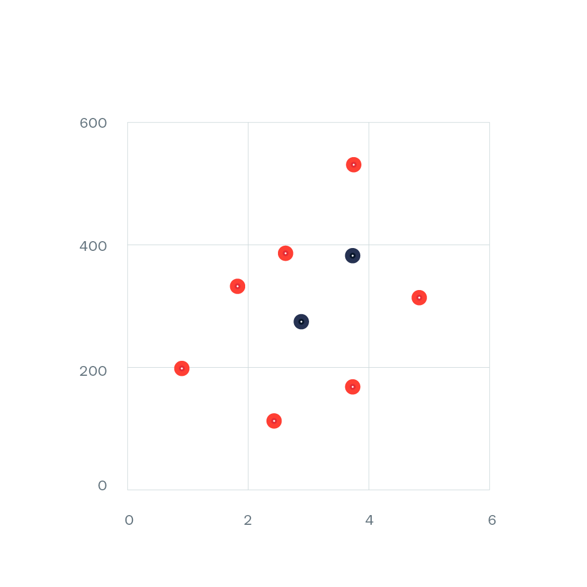{.absolute top=100 right=50 width="500" height="500"}

::: {.fragment}
Mărime

&nbsp;&nbsp;&nbsp;&nbsp;Lățime 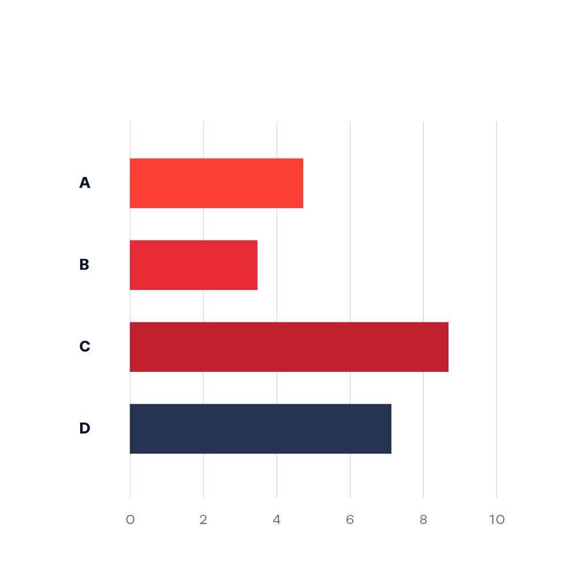{.absolute top=100 right=50 width="500" height="500"}
:::

::: {.fragment}
&nbsp;&nbsp;&nbsp;&nbsp;Înălțime 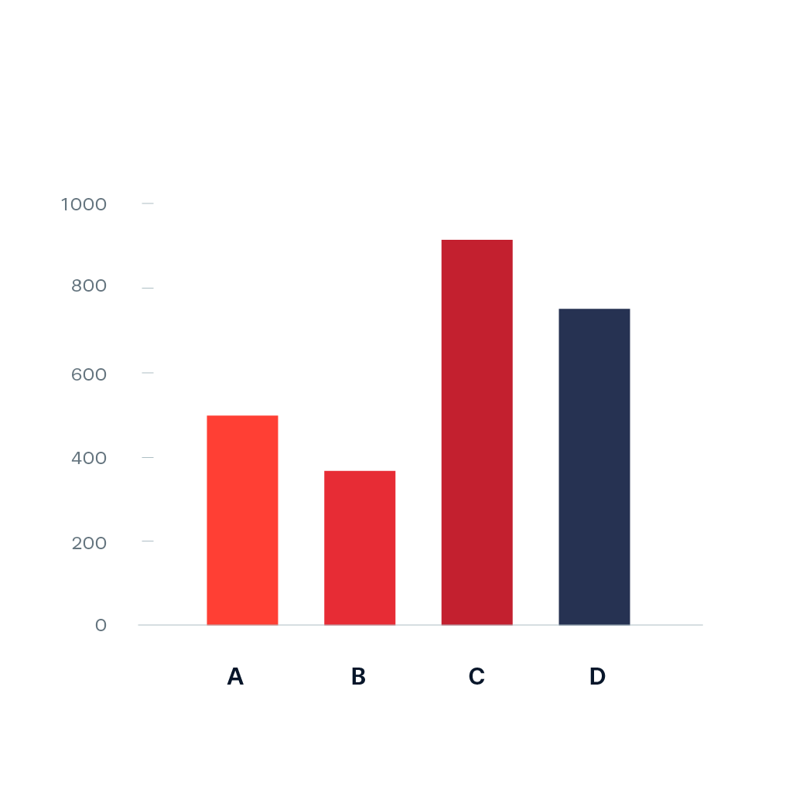{.absolute top=100 right=50 width="500" height="500"}
:::

::: {.fragment}
&nbsp;&nbsp;&nbsp;&nbsp;Suprafață 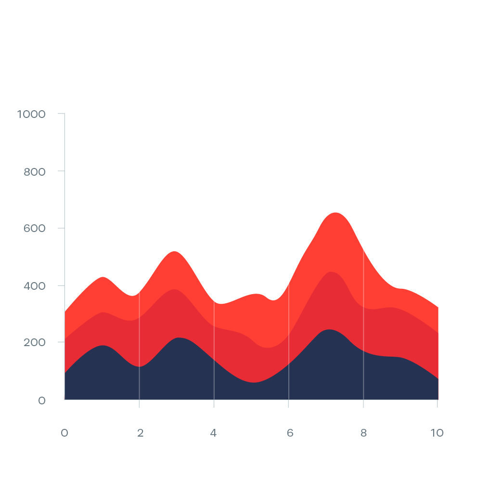{.absolute top=100 right=50 width="500" height="500"}
:::

::: {.fragment}
Culoare

&nbsp;&nbsp;&nbsp;&nbsp;Umplutură 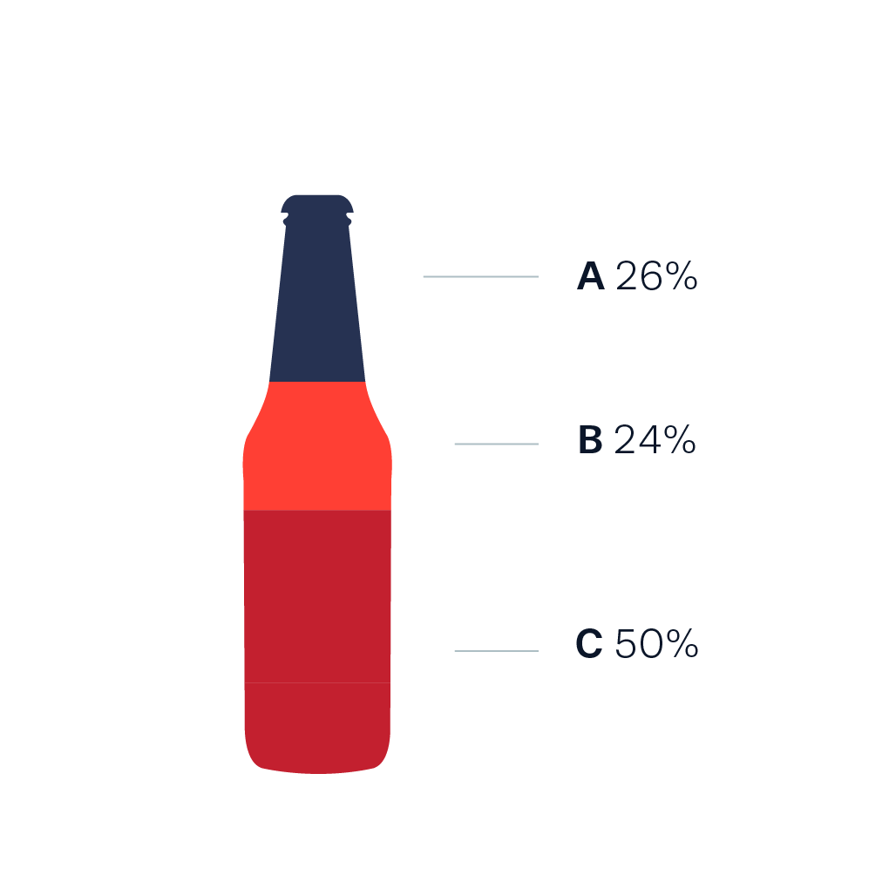{.absolute top=100 right=50 width="500" height="500"}
:::

::: {.fragment}
&nbsp;&nbsp;&nbsp;&nbsp;Culoare 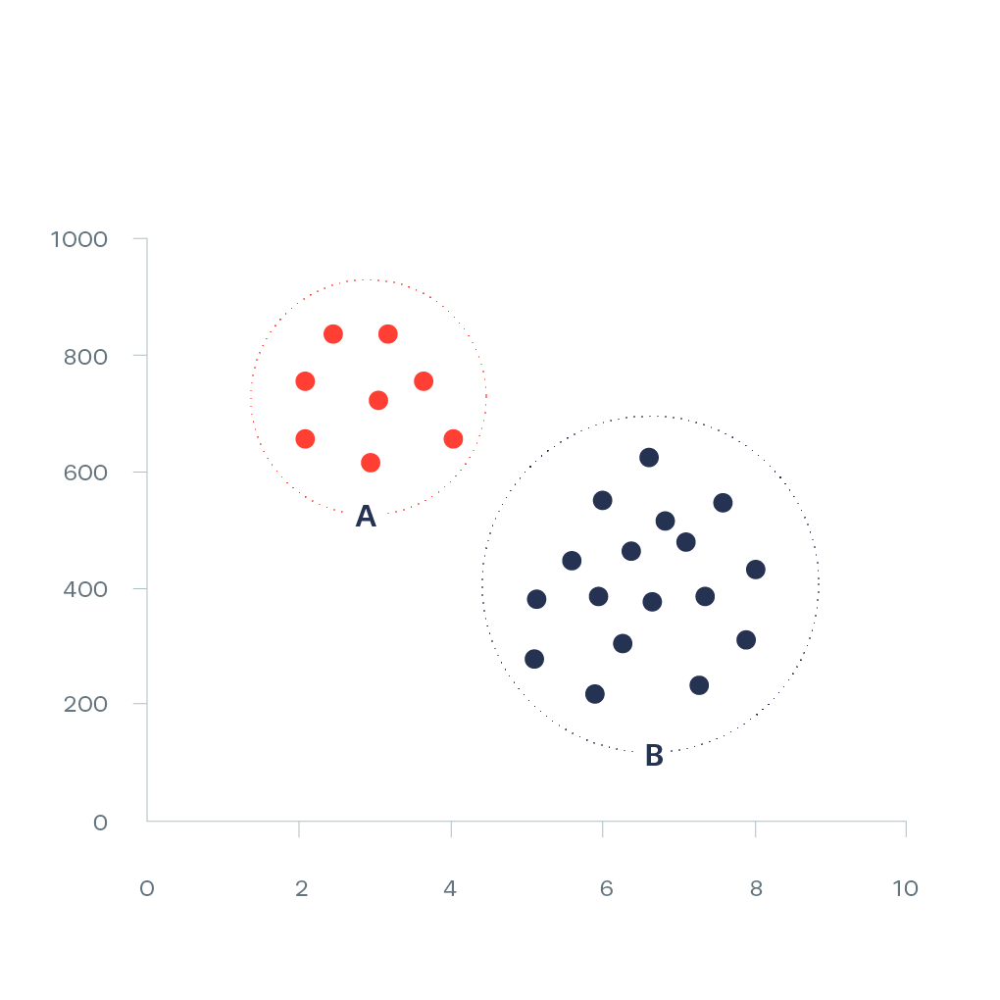{.absolute top=100 right=50 width="500" height="500"}
:::

::: {.fragment}
&nbsp;&nbsp;&nbsp;&nbsp;Transparență

&nbsp;&nbsp;&nbsp;&nbsp;Model

Formă 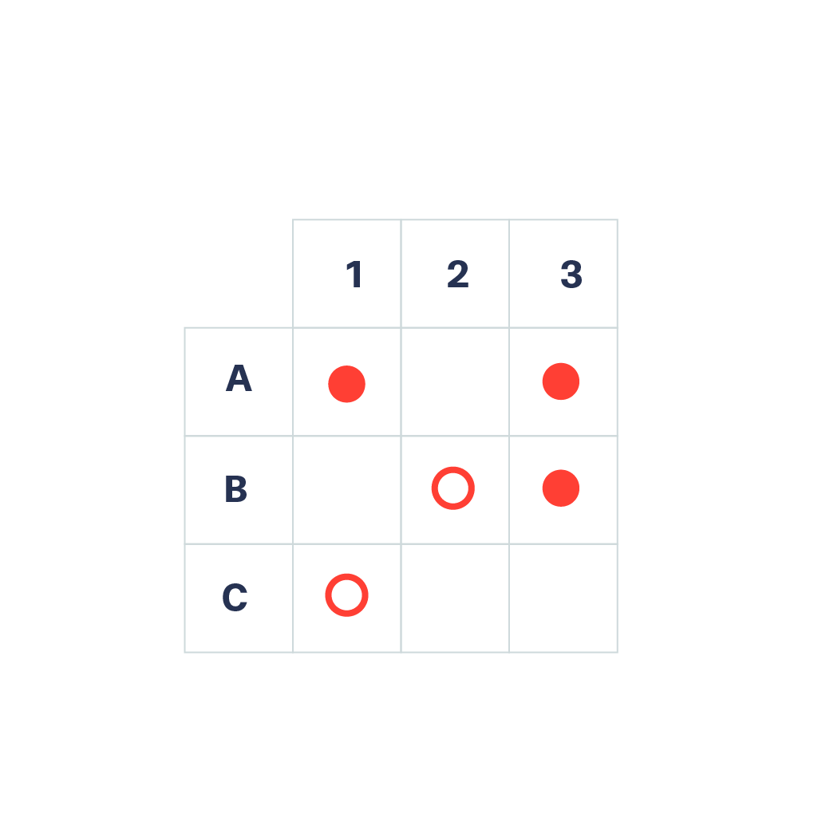{.absolute top=100 right=50 width="500" height="500"}
:::

::: {.fragment}
Locație 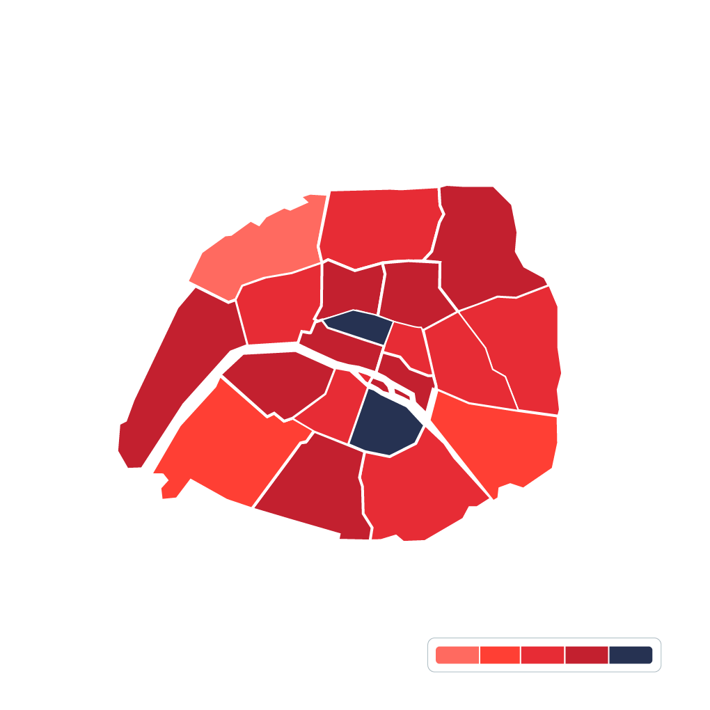{.absolute top=100 right=50 width="500" height="500"}
:::


## Ce tipuri de codificare vizuală puteți identifica în acest grafic? {background-color="#fff1e0"}

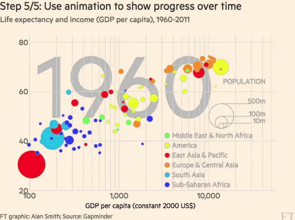{.absolute height="500"}

## Graficul de dispersie FT {background-color="#fff1e0"}

::: {.fragment .fade-in-then-out}
Grafic de dispersie {.absolute top=100 right=20 height="450"}
:::

::: {.fragment .fade-in-then-out}
Scară logaritmică {.absolute top=100 right=20 height="450"}
:::

::: {.fragment .fade-in-then-out}
Schimbă mărimile {.absolute top=100 right=20 height="450"}
:::

::: {.fragment .fade-in-then-out}
Colorează {.absolute top=100 right=20 height="450"}
:::

::: {.fragment}
Animează anii {.absolute top=100 right=20 height="450"}
:::

::: notes
https://www.ft.com/content/e2eba288-ef83-11e6-930f-061b01e23655
:::


## Instrumente pentru grafice

<iframe class="stretch" data-src="https://samizdata.co/training/toolbox#visualisation"></iframe>
::: footer
Sursă: [SAMIZDATA](https://samizdata.co/training/toolbox#visualisation)
:::

## Tipuri de grafice

- [FT Vocabulary](https://github.com/Financial-Times/chart-doctor/tree/main/visual-vocabulary)
- [Data Viz Project](https://datavizproject.com/)
- [Data to Viz](https://www.data-to-viz.com/)
- [Data Visualisation Catalogue](https://datavizcatalogue.com/)


## Bare/coloane { background-color="white"}

::: columns
::: {.column width="60%"}

:::

::: {.column width="40%"}
Dreptunghiuri orizontale sau verticale în care lungimile sunt proporționale cu valorile pe care le reprezintă.
<br><br>
Potrivit pentru a compara numere sau a arăta trend-uri.
:::
:::

## Linii { background-color="white"}

::: columns
::: {.column width="60%"}
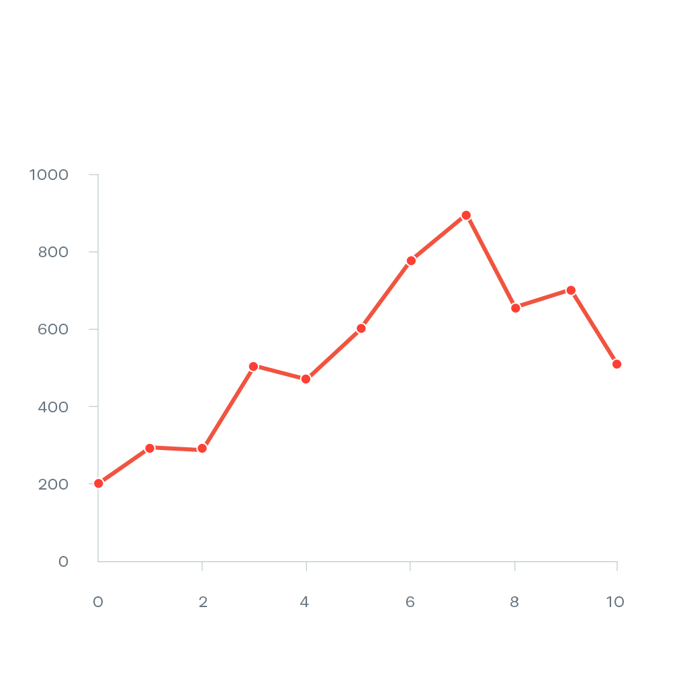
:::

::: {.column width="40%"}
Arată numere pe o scară continuă. Similar cu graficul de dispersie, doar că punctele sunt conectate.
<br><br>
Potrivit pentru a arăta trend-uri.
:::
:::


## Grafic de suprafață { background-color="white"}

::: columns
::: {.column width="60%"}

:::

::: {.column width="40%"}
Asemănătoare graficelor cu linii, însă suprafață de sub linie este colorată. Suprapuse, pot arăta trend-uri cumulative.
<br><br>
Potrivit pentru a arăta trend-uri.
:::
:::

## Grafic de dispersie { background-color="white"}

::: columns
::: {.column width="60%"}

:::

::: {.column width="40%"}
Reprezintă grafic un set de date pe două dimensiuni continue, fiecare pe o axă diferită (X și Y).
<br><br>
Potrivit pentru a ilustra corelația dintre diferite serii de date.
:::
:::

## Hartă { background-color="white"}

::: columns
::: {.column width="60%"}

:::

::: {.column width="40%"}
Funcționează doar cu date geografice (evident!).
<br><br>
Chiar și în cazul datelor geografice, alte tipuri de diagrame pot fi adesea o alegere mai bună.
:::
:::


## Anatomia unui grafic {background-color="white"}


::: footer
Sursă: [BBC News](https://www.bbc.com/news/business-64322574)
:::

::: notes
- Title
- Subtitle / description
- Series
- Labels
- Gridlines
- x-axix
- y-axis
- Legend/key
- Source
:::

## Alegerea culorilor {background-color="white"}


::: notes
Sequential: Colours (of the same hue) that go from light to dark or the other way around. Usually, darker means higher value.

Diverging: Similar to sequential, but they have a light middle colour that turns darker on both ends of the scale. Useful when you have both positive and negative values.

Categorical: For values that aren't on a numeric scale or don't have an intrinsic order. Useful when none of the colours are more important than others.
:::

::: footer
Sursă: [Datawrapper](https://www.datawrapper.de/blog/which-color-scale-to-use-in-data-vis)
:::

## Reprezentarea genului

<iframe class="stretch" data-src="https://www.datawrapper.de/blog/gendercolor"></iframe>

::: footer
Sursă: [Datawrapper](https://www.datawrapper.de/blog/gendercolor)
:::

## Instrumente

<iframe class="stretch" data-src="https://samizdata.co/training/toolbox#colours"></iframe>
::: footer
Sursă: [SAMIZDATA](https://samizdata.co/training/toolbox#colours)
:::


## Font-uri {background-color="white"}

<iframe class="stretch" data-src="https://blog.datawrapper.de/fonts-for-data-visualization/"></iframe>
::: footer
Sursă: [Datawrapper](https://blog.datawrapper.de/fonts-for-data-visualization/)
:::

## Grafice eronate: Daily Mail


::: footer
Sursă: [Daily Mail](https://www.dailymail.co.uk/news/article-8028565/EU-leaders-argue-early-hours-bruising-budget-talks.html)
:::

## Grafice eronate: The Sun
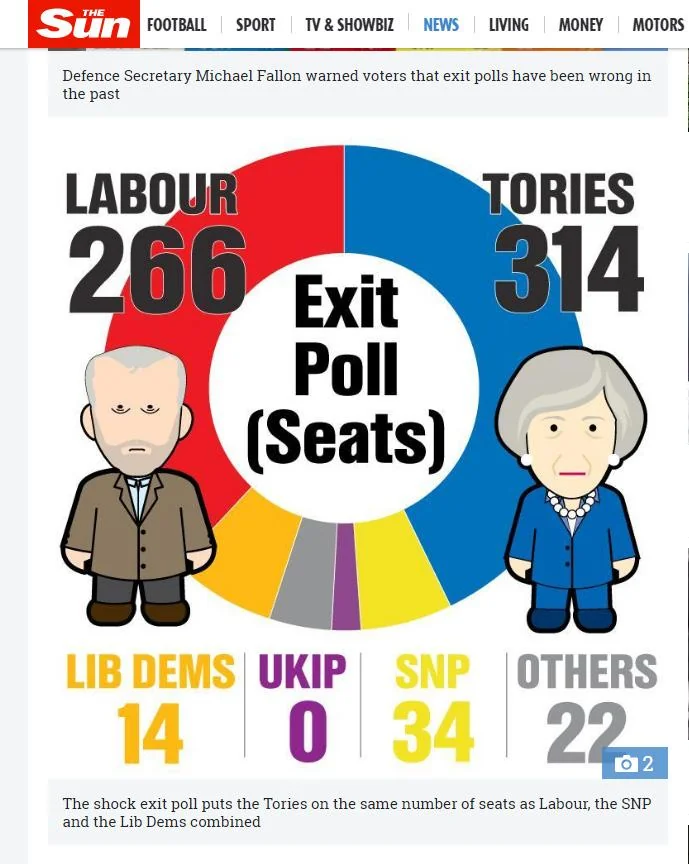

::: footer
Sursă: The Sun
:::

## Grafice eronate: Reuters
{.absolute top=90 left=0 height="500"}

::: fragment
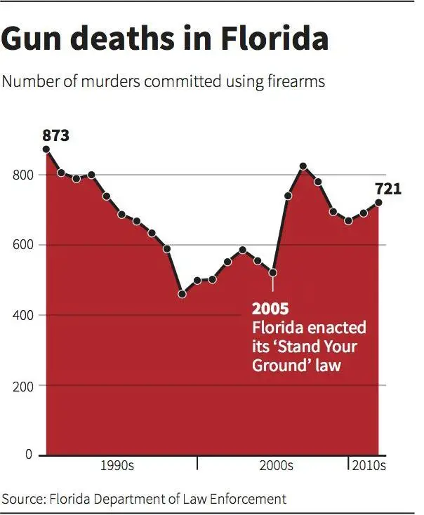{.absolute top=90 left=0 height="456"}
:::

::: footer
Sursă: Reuters
:::

## Grafice eronate: CBS News


::: footer
Sursă: CBS News
:::

## Grafice eronate: PAS


::: footer
Sursă: [Natalia Gavriliță](https://www.facebook.com/NataliaGavrilitaPM/posts/pfbid02MDSpYWRMeEmQcNKjmchqHza77UTSQKwyGxt1Kbaa6JF4dCpitxiH8zXaARfesxMrl)
:::

## Grafice eronate: PAS
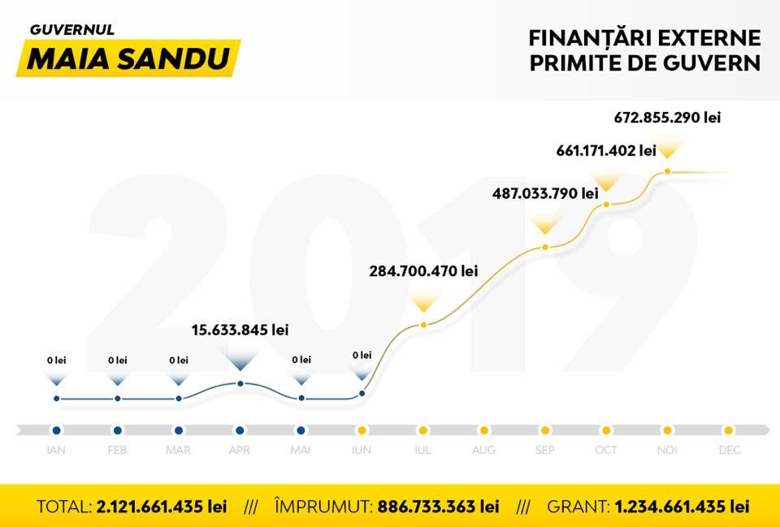

::: footer
Sursă: [Natalia Gavriliță](https://www.facebook.com/photo.php?fbid=3736590023025196&set=pb.100063578236855.-2207520000&type=3)
:::

## Grafice eronate: PAS
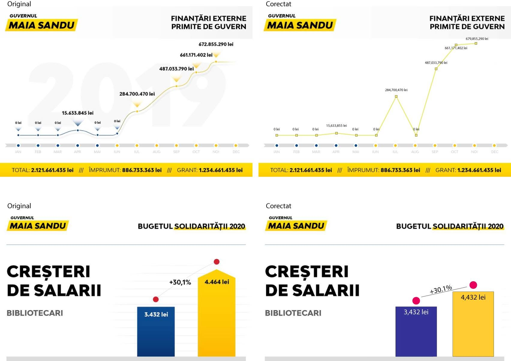

::: footer
Sursă: [Nicu Calcea](https://www.facebook.com/nicucalcea/posts/pfbid0dLHWpZrKvDac46zLt8vuYax4kUY1eJNVKfhhyf3is3pUSHZpg7VgV2sZNJYnmckml?__tn__=%2CO*F)
:::

## WTF Visualizations

<iframe class="stretch" data-src="https://viz.wtf/"></iframe>
::: footer
Sursă: [WTF Visualizations](https://viz.wtf/)
:::


# Exercițiu: Prenumele nou-născuților

Care este cel mai popular prenume pentru bebelușii din Moldova?

1. Descărcați [rapoartele pentru 2023 și 2022](https://dataset.gov.md/ro/dataset?q=prenume+copii&sort=views_recent+desc).
2. Folosiți [Tabula](http://tabula.ondata.it) pentru a extrage tabelele din PDF-uri.
3. Încărcați tabelele în Google Sheets și curățați-le.
4. Creați un grafic/tabel în Datawrapper.

::: notes
Show how to do this with AI, maybe with the datawrapper MCP
:::


# Exercițiu de grup

1. Creați grupuri de 4 persoane.
2. Identificați un set de date relevant pentru Republica Moldova (indiciu: verificați [site-ul BNS](https://statistica.gov.md/ro) și [dataset.gov.md](https://dataset.gov.md/dataset/)).
3. Produceți un mic material jurnalistic cu 1-2 grafice.

```{=html}
<div style="text-align:center;margin-top:0.8em;">
  <div id="timer-display" style="font-size:2.5em;font-weight:bold;font-variant-numeric:tabular-nums;">45:00</div>
  <button id="timer-start" style="font-size:0.6em;margin:0.2em;padding:0.3em 1em;cursor:pointer;">Start</button>
  <button id="timer-pause" style="font-size:0.6em;margin:0.2em;padding:0.3em 1em;cursor:pointer;">Pauză</button>
  <button id="timer-reset" style="font-size:0.6em;margin:0.2em;padding:0.3em 1em;cursor:pointer;">Reset</button>
</div>
<script>
(function() {
  const total = 45 * 60;
  let remaining = total;
  let timer = null;
  const el = document.getElementById('timer-display');
  function fmt(s) { const m = Math.floor(s / 60); const sec = s % 60; return String(m).padStart(2, '0') + ':' + String(sec).padStart(2, '0'); }
  function render() { el.textContent = remaining <= 0 ? 'Timp expirat!' : fmt(remaining); el.style.color = (remaining <= 60 && remaining > 0) ? '#c00' : ''; }
  function tick() { if (remaining > 0) { remaining--; render(); if (remaining === 0) { clearInterval(timer); timer = null; } } }
  document.getElementById('timer-start').onclick = () => { if (!timer && remaining > 0) timer = setInterval(tick, 1000); };
  document.getElementById('timer-pause').onclick = () => { clearInterval(timer); timer = null; };
  document.getElementById('timer-reset').onclick = () => { clearInterval(timer); timer = null; remaining = total; render(); };
  render();
})();
</script>
```


# [👋]{.wave} Vă mulțumesc pentru atenție

```{=html}
<style>
  .wave {
  animation-name: wave-animation;  /* Refers to the name of your @keyframes element below */
  animation-duration: 2.5s;        /* Change to speed up or slow down */
  animation-iteration-count: infinite;  /* Never stop waving :) */
  transform-origin: 70% 70%;       /* Pivot around the bottom-left palm */
  display: inline-block;
}

@keyframes wave-animation {
    0% { transform: rotate( 0.0deg) }
   10% { transform: rotate(14.0deg) }  /* The following five values can be played with to make the waving more or less extreme */
   20% { transform: rotate(-8.0deg) }
   30% { transform: rotate(14.0deg) }
   40% { transform: rotate(-4.0deg) }
   50% { transform: rotate(10.0deg) }
   60% { transform: rotate( 0.0deg) }  /* Reset for the last half to pause */
  100% { transform: rotate( 0.0deg) }
}
</style>
```

- [Site personal](https://nicu.md/)
- [SAMIZDATA](https://samizdata.co/ro)
- [mail@nicu.md](mailto:mail@nicu.md)
